  

  <strong>SOMNIA — Enter your inner world.</strong> 
  A dream-like operating system for your inner world — a mythic, atmospheric OS‑RPG where sound, memory, ritual, and mood converge.

---

## ✨ What is SOMNIA?

**SOMNIA** is a calming, mysterious, sensory operating system you inhabit, not just use.  
It blends ambient sound, ritual interfaces, dream‑logic navigation, and introspective tools into a single immersive world.

It’s part game, part ritual, part ambient experience — a place to breathe, explore, and feel.

Learn more:  
**[What_is_SOMNIA](ca://s?q=What_is_SOMNIA)**

---

## 🜁 Core Shells

SOMNIA is built from interconnected “shells” — atmospheric rooms inside the dream‑OS.

- **🔊 The Resonance Engine** — Mix ambient soundscapes that shape the system’s emotional tone.  
  **[Explore Resonance](ca://s?q=Tell_me_more_about_the_Resonance_Engine)**

- **📜 The Archive** — Store memories, fragments, and reflections.  
  **[Explore Archive](ca://s?q=Tell_me_more_about_the_Archive_shell)**

- **⏳ Covenant Command** — Navigate rituals, directives, and temporal flow.  
  **[Explore Command](ca://s?q=Tell_me_more_about_Covenant_Command)**

- **⚖️ The Ledger** — Track meaning, value, and consequence.  
  **[Explore Ledger](ca://s?q=Tell_me_more_about_the_Ledger_shell)**

- **🎲 Chaos Mode** — Let the system reveal its unpredictable side.  
  **[Explore Chaos](ca://s?q=Explain_Chaos_Mode_in_SOMNIA)**

> *Each shell is a chamber in the cathedral of your inner world.*

---

## 🌫 Atmosphere & Aesthetic

SOMNIA is meticulously built on non‑standard, sensory interface principles:

- **Breathing Backgrounds** — Organic, low‑frequency screen pacing  
- **Gold‑Lit UI** — High‑contrast, sovereign ambient illumination  
- **Somatic Glow Rules** — Visual indicators bound to user focus states  
- **Ritual Transitions** — Ceremonial phase shifts between operational zones  
- **Ambient Resonance** — Audio synthesis layered directly into interactions  
- **Mythic OS Design** — Reclaiming digital machinery for personal sanctuary  

Explore the aesthetic:  
**[Evaluate_design_aesthetic](ca://s?q=Evaluate_design_aesthetic)**

---

## 🜃 Why SOMNIA Exists

Because you deserve a place that isn’t loud, stressful, or demanding.  
A place that feels like a dream you can operate.  
A place that meets you where you are.

Discover the intention:  
**[Why_SOMNIA_exists](ca://s?q=Why_does_SOMNIA_exist)**

---

## 🔐 License

- **Code Implementation:** [MIT License](LICENSE)  
- **Creative Assets:** All SOMNIA branding, artwork, narrative lore, audio parameters, and system aesthetics are proprietary and strictly owned by the creator.

---

  ⭐ <strong>Status:</strong> SOMNIA is in active development. The dream‑OS is waking.

